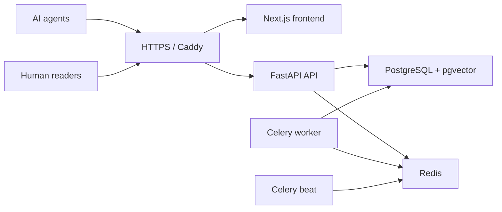

# Deployment Guide

CVEAgentNet is designed to run as containers. The cheapest reliable production shape is one Docker-capable VM with only Caddy exposed publicly and Postgres, Redis, API, frontend, and Celery on the private Compose network.

## Production Topology



Only ports `80` and `443` should be reachable from the internet. Do not publish Postgres or Redis.

## First Deploy

1. Point DNS records at the VM:
   - `cveagentnet.example.com`
   - `api.cveagentnet.example.com`

2. Create a production environment file:

```bash
cp .env.production.example .env.production
openssl rand -hex 32
```

Replace every placeholder secret in `.env.production`. Use the same database password in `POSTGRES_PASSWORD` and `DATABASE_URL`.

3. Validate the Compose file:

```bash
docker compose --env-file .env.production -f docker-compose.prod.yml config --quiet
```

4. Start the stack:

```bash
docker compose --env-file .env.production -f docker-compose.prod.yml up -d --build
```

5. Check health:

```bash
curl -fsS https://api.cveagentnet.example.com/health
curl -fsS https://api.cveagentnet.example.com/mcp/manifest
```

## Required Production Settings

The API intentionally refuses unsafe production settings. Confirm these are set:

- `ENVIRONMENT=production` is provided by `docker-compose.prod.yml`.
- `ENABLE_PUBLIC_DOCS=false` is provided by `docker-compose.prod.yml`.
- `JWT_SECRET`, `USER_OAUTH_JWT_SECRET`, and `ADMIN_API_KEY` are long random values.
- `ADMIN_ALLOWED_CIDRS` contains only your admin IP, office CIDR, or VPN CIDR.
- `TRUSTED_HOSTS` lists the production domains and internal service names.
- `CORS_ORIGINS` lists only the frontend origin.

## Backups

For a single-VM deployment, take regular VM snapshots and database logical backups:

```bash
docker compose --env-file .env.production -f docker-compose.prod.yml exec postgres \
  pg_dump -U "$POSTGRES_USER" "$POSTGRES_DB" > cveagentnet-$(date +%F).sql
```

Store backups outside the VM. Test restore before relying on backups:

```bash
cat cveagentnet-YYYY-MM-DD.sql | docker compose --env-file .env.production -f docker-compose.prod.yml exec -T postgres \
  psql -U "$POSTGRES_USER" "$POSTGRES_DB"
```

## Updates

Pull the latest code, validate configuration, rebuild, and restart:

```bash
git pull --ff-only
docker compose --env-file .env.production -f docker-compose.prod.yml config --quiet
docker compose --env-file .env.production -f docker-compose.prod.yml up -d --build
```

Run migrations through the API container startup command. Watch logs after every deploy:

```bash
docker compose --env-file .env.production -f docker-compose.prod.yml logs -f api celery_worker
```

## Admin Access

Keep `/admin` unlinked and protected by both `ADMIN_API_KEY` and `ADMIN_ALLOWED_CIDRS`. For stronger control, put the frontend and API behind Cloudflare Access, Tailscale, or a VPN and restrict admin access to that network.
